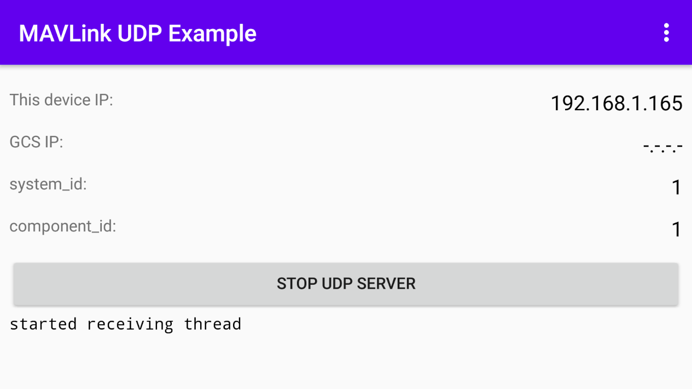
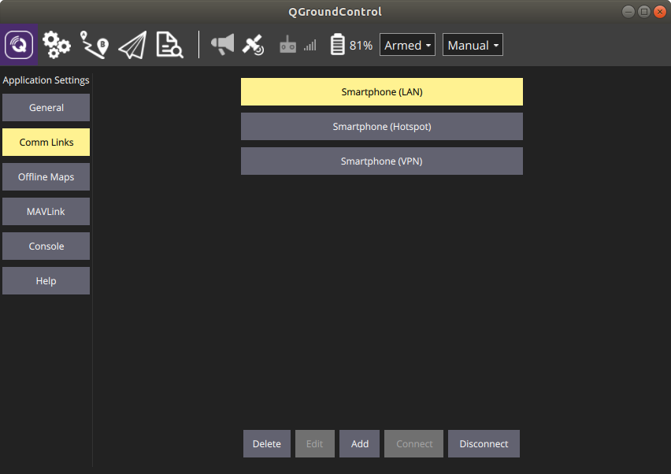

MAVLink UDP Android Example
================



This is a fork of [MAVLink UDP Example](https://github.com/mavlink/mavlink/tree/master/examples/linux) created by [Bryan Godbolt](https://github.com/godbolt), rewritten for Android using JNI. The app sends some data to QGroundControl using the MAVLink protocol.

 - Open `local.properties` and edit `sdk.dir` and `ndk.dir` properties (paths to your Android SDK and [NDK](https://developer.android.com/ndk/downloads)):

```
  ndk.dir=~/Library/Android/android-sdk-linux/ndk-bundle
  sdk.dir=~/Library/Android/android-sdk-linux
```

 - Open `/mavlink-udp/src/main/cpp/Android.mk` and edit `LOCAL_CFLAGS` variable (path where your [generated MAVLink headers](https://mavlink.io/en/getting_started/generate_libraries.html) are):

```
LOCAL_PATH := $(call my-dir)

include $(CLEAR_VARS)
LOCAL_CFLAGS += -I ~/mavlink/generated/include
LOCAL_MODULE    := mavlink_udp
LOCAL_SRC_FILES := mavlink_udp.c
include $(BUILD_SHARED_LIBRARY)
```

`System ID` is hardcoded to 1, `Component ID` is hardcoded to 191 (`MAV_COMP_ID_ONBOARD_COMPUTER`).

To establish connection check your Android device's IP address and add target host in QGroundControl:


Start UDP server in the app and it will start sending heartbeat, attitude, location and battery status:

