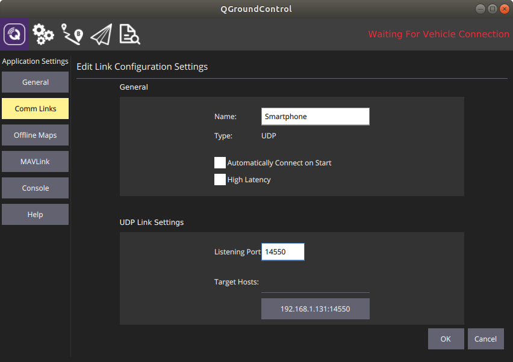

MAVLink UDP Android Example
================


This is a fork of [MAVLink UDP Example](https://github.com/mavlink/mavlink/tree/master/examples/linux) created by [Bryan Godbolt](https://github.com/godbolt), rewritten for Android using JNI. The app sends some data to QGroundControl using the MAVLink protocol.

 - Open `local.properties` and edit `sdk.dir` and `ndk.dir` properties (paths to your Android SDK and [NDK](https://developer.android.com/ndk/downloads)):

```
  ndk.dir=~/Library/Android/android-sdk-linux/ndk-bundle
  sdk.dir=~/Library/Android/android-sdk-linux
```

 - Download: [c_library_v2](https://github.com/mavlink/c_library_v2) or generate: [generate_libraries](https://mavlink.io/en/getting_started/generate_libraries.html) MAVLink headers.

 - Open `/mavlink-udp/src/main/cpp/Android.mk` and edit `LOCAL_CFLAGS` variable so that it points to the folder where you keep the headers.

```
LOCAL_PATH := $(call my-dir)

include $(CLEAR_VARS)
LOCAL_CFLAGS += -I ~/mavlink/generated/include
LOCAL_MODULE    := mavlink_udp
LOCAL_SRC_FILES := mavlink_udp.c
include $(BUILD_SHARED_LIBRARY)
```

 - If you're having trouble building the project (`The system cannot find the file specified`) - try downloading [older NDK version](https://developer.android.com/ndk/downloads/older_releases#ndk-16b-downloads).

`system_id` and `component_id` values are both set to 1 by default, but can be set by the user.

Latest build of the app can be downloaded here: [mavlink-udp-debug.apk](https://github.com/mareksuma1985/mavlink/blob/master/examples/android/mavlink-udp/build/outputs/apk/debug/mavlink-udp-debug.apk).

To establish connection check your Android device's IP address and add target host in QGroundControl:


Start UDP server in the app and it will start sending heartbeat, attitude, location and battery status:

